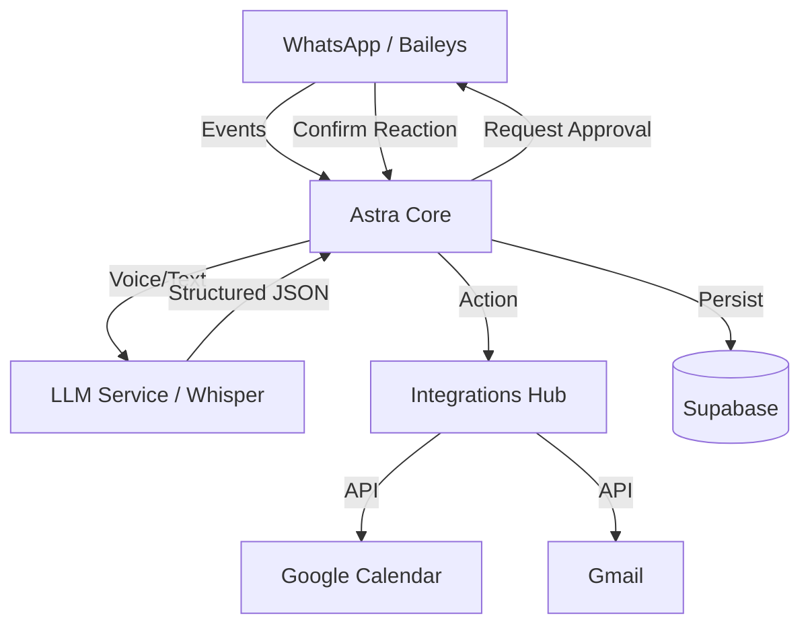

# Architecture: Astra EA

## 1. High-Level System Overview
Astra EA follows a **Service-Oriented Architecture** (SOA) to ensure modularity and ease of testing.

## 2. Technology Stack
- **Runtime**: Node.js with TypeScript (Strict Mode).
- **WA Engine**: Baileys (Internal WhatsApp Web library).
- **Persistence**: Supabase (PostgreSQL + Auth).
- **Intelligence**: OpenAI (GPT-4o for parsing, Whisper for transcription).
- **Integrations**: Google APIs via `googleapis` library.

## 3. Modular Services
1.  **WhatsApp Service**: Manages socket connection, authentication (QR code), and incoming message streams.
2.  **Intent Engine**: Handles the transformation of raw strings/audio into actionable commands using LLMs.
3.  **Integration Hub**: Standardized wrappers for external APIs (Google, etc.).
4.  **State Manager**: Handles reminders, session state, and user preferences in Supabase.

## 4. Key Design Decisions
- **Local-First Connectivity**: The Baileys instance runs locally to keep the session alive and secure.
- **Stateless Intelligence**: The LLM doesn't store history; context is provided per request to minimize tokens and complexity.
- **Reaction-Based UX**: Using WhatsApp reactions (e.g., 👍) as the primary confirmation mechanism to keep the chat clean.

## 5. Security & Privacy
- OAuth2 for Google services.
- Supabase RLS (Row Level Security) for data isolation.
- Minimal data persistence (only reminders and necessary logs).
